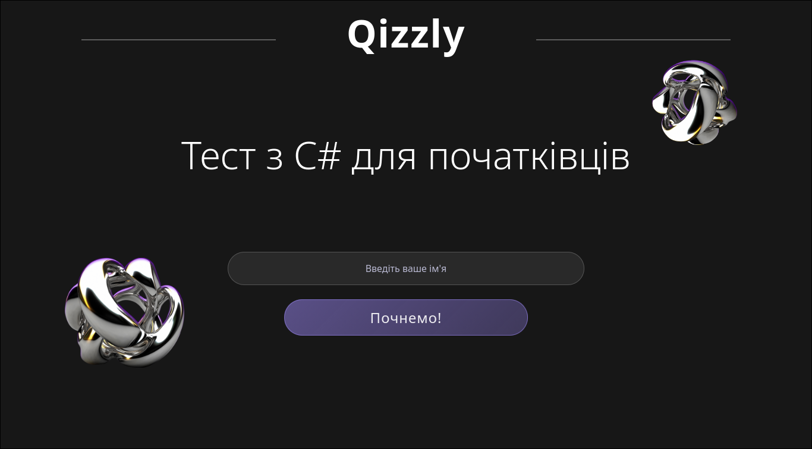
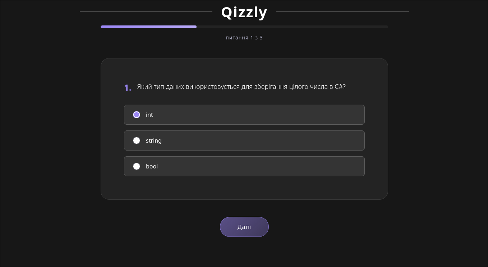
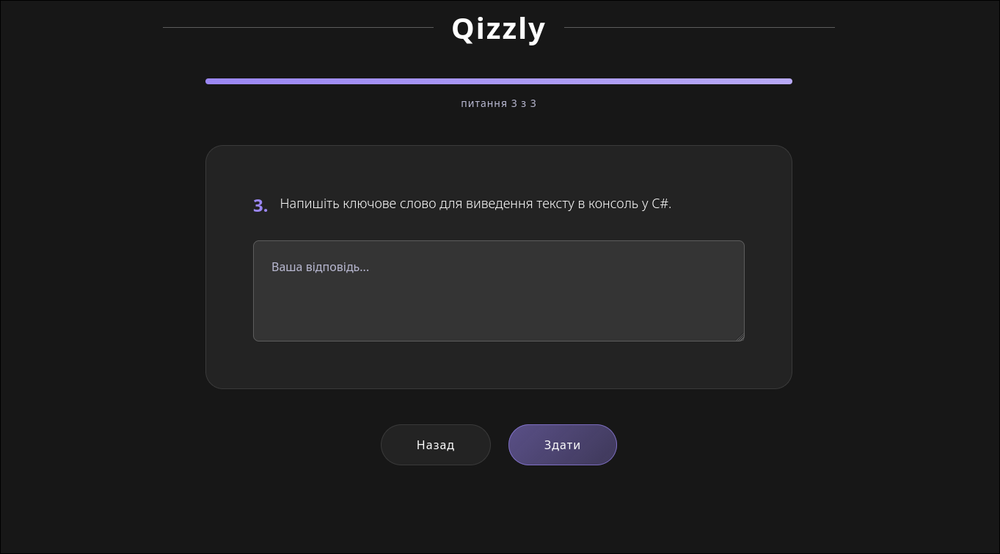
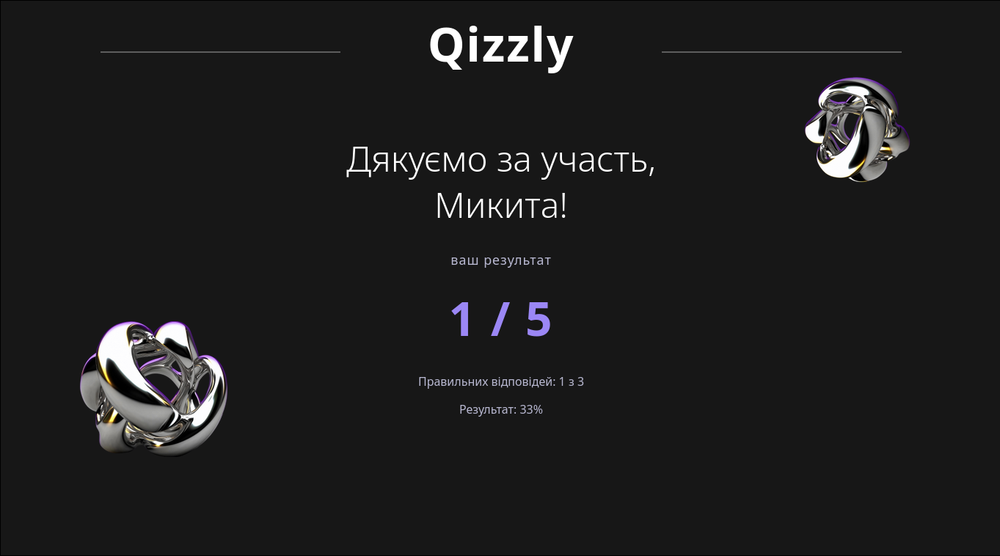
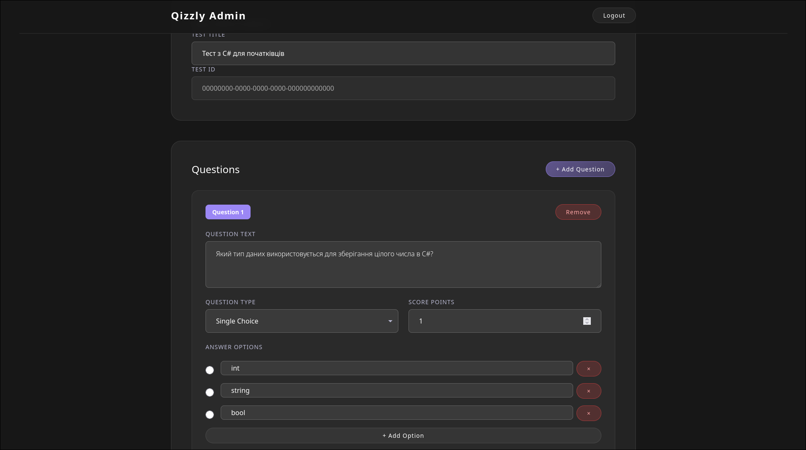
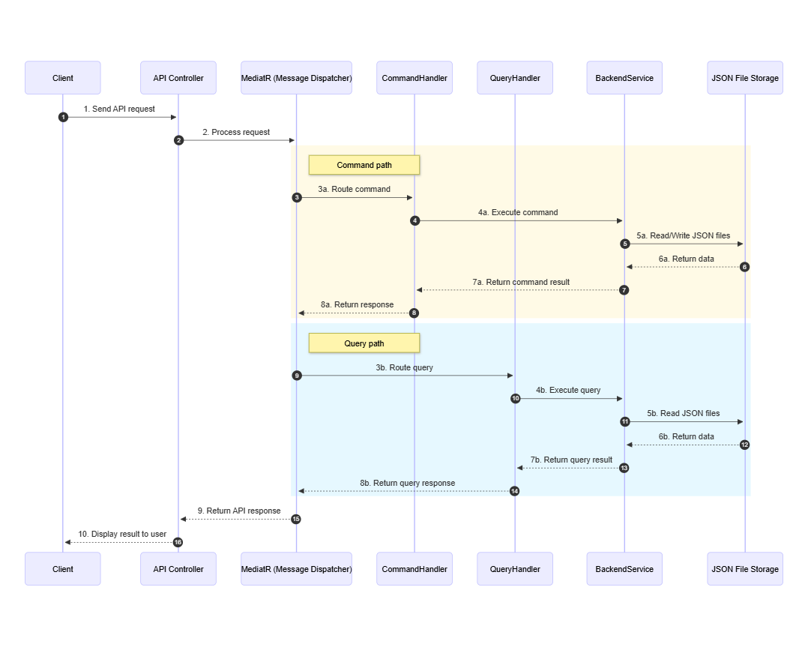
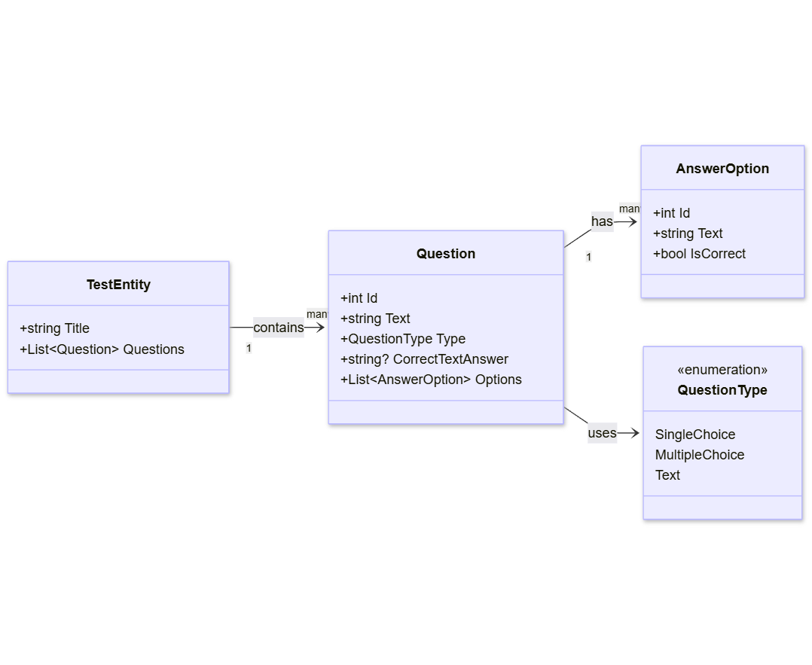

# Qizzly Test Application
|  |  |
|------------------|-------------------|
|  |  |
|  |  |



## Getting Started

**First time setup?** See [PROJECT_STARTUP.md](docs/PROJECT_STARTUP.md) for:
- Docker installation
- How to run the application
- Troubleshooting tips

## Development Workflow

1. Clone repository (one time only)
```bash
git clone https://github.com/NickSishchuck/izvp-test.git
cd izvp-test
```

2. Checkout your branch
```bash
git checkout dev/{yourname}
```

3. Make changes and commit
```bash
git add .
git commit -m "Add your description here"
git push origin dev/{yourname}
```

4. Create PR on Github and wait for approval

## Team Leads

- **Frontend lead:** Mykyta
- **Backend lead:** Dmytro

## Architecture Diagrams

### API Sequence Diagram


### Class Diagram

